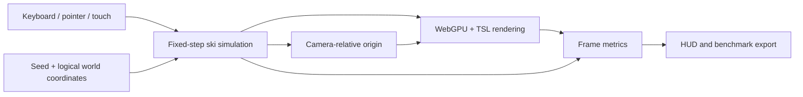

# Architecture

The prototype keeps world description, simulation, rendering, and instrumentation
independent. Rendering reads simulation state but never decides gameplay outcomes.

The browser frame loop accumulates real time and advances the authoritative
simulation in exact 1/60-second steps. A 200 ms accumulator cap prevents runaway
catch-up after a suspended tab. The renderer receives the current state and a
small, rebased coordinate for GPU-safe arithmetic.

Future world cells can implement a deterministic descriptor interface without
altering the simulation or renderer contracts. A CPU mirror will remain
authoritative for nearby collision queries.
